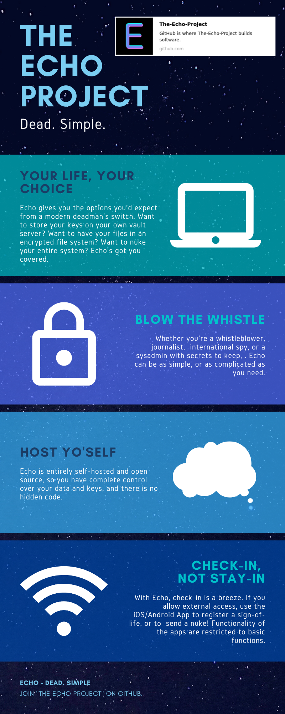

[](code_of_conduct.md)
[](https://join.slack.com/t/echo-grv2201/shared_invite/zt-fugeli6c-JiPbjJyjRIvsPOfx6~jWWA)



# Some vision

```DISCLAIMER: While below is a generic vision for where the project might be going in the future, the current focus is on the server-side system. Currently no work will be done for any external app for iOS or Android. Once the server-side API is fully functional, we can begin building integrations. ```

Here are my initial notes for this project. Hopefully for those wanting to join the team, it'll provide some insight into the project goals, and what we're trying to achieve.

Firstly, I suppose, is why? Tools exist like “Deadswitch” and “Deadmansswitch”, that will allow you to send emails or decryption keys to a party in the event of “no-contact”, but I feel as though they aren’t particularly sophisticated. Essentially, their service will stores messages, and email them to the recipients you configure. In most cases, and for the general public, this simplicity is enough, but for those of us who are technically-minded, or have a lot of data, it’s not ideal.

Let's get an example of a use-case. You've got data that would be inaccessible should you die or be otherwise incapacitated, and you want to make sure you family (or other contact) is able to access and view it. It could be account passwords, a journal, cryptocurrency files, or anything else storable in a archival format (zip, tar etc).

Although on the surface it seems like  simple concept, there are many questions this scenario raises;

- How would such a service be hosted?
 - For me, based on the systems I already use, I would create a Digital Ocean droplet, and run the application there.
   - This raises another question that I think will be a key foundation for the project, how easy will it be to update the file content? - For example, perhaps I want to keep a track of my journal and have it updated on the echo system automatically so that if something happens to me, the content/key sent out is always representative of the latest version of data.
- How does the service detect death or incapacitation?
  - There are multiple options available to us here, some vastly more difficult, but perhaps necessary.
   - iOS/Android app that connects to your echo environment and allows you to check-in, see the remaining time, and configure settings.
   - An email with a custom, one-time link for check-in.
   - Some sort of notification that can process read receipts.
     - No idea if this exists, but for example, we could set up WhatsApp to send a message to the user, and acknowledge a check-in if the message flips to “read”. It’d really cut down on the hassle of checking in.
   - External Bluetooth device?
     - See my thoughts on a “nuke sequence” for more on this.

- What if one is simply incapacitated for an extended time?
   - Do I really want such a wealth of personal data exposed during a temporary situation?
   - Can we differentiate between death, and someone being otherwise incapacitated?

- What features does one need?  
  - Would a LUKS encrypted ext4 filesystem be overkill? Or perhaps just the right amount of kill?
  - How do we separate data & keys effectively to prevent obvious attack opportunities?
    - Data and keys hosted on the same system might be asking for trouble. Perhaps vault integration?
  - Email
  - Text
  - Push notification via an app?

My key vision for Echo is options. Current solutions lack such a thing and have no real user configuration or self-hosting. I want to be able to set up a system that allows people, with the means, to be able to control their own data & keys, in a way (through integrations) that means they can rely on the product.

The target audience for Echo is whistleblowers, journalists, and government agents.. basically anyone with a need to conceal sensitive data, but also wants a contingency plan for it in case of death. With such sensitive data, what happens if you become compromised, or access to your echo account is compromised? Well, for that, in addition to being able to release data, one might need to also destroy data. The real question I want to note here is;

- What is the balance between easy/difficult, to ensure data cannot be destroyed by accident, but also allowing someone to send a nuke command quickly if they face an immediate threat?
 - Currently, I'm toying with the idea of an external bluetooth device with a single physical button. It can register "tones", which are a series of clicks in a particular order, to send certain commands. This would potentially be a concealed way to send commands to the system if one finds themselves in a compromised position. More research and investigation required.
